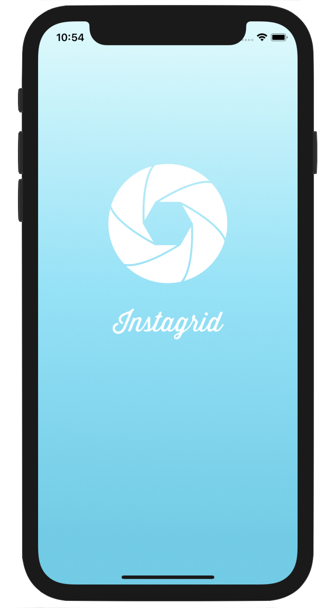

# Instagrid

**Instagrid** is a picture collage iOS application in MVC architecture, that allows user to create different layouts of collage with their pictures.

 

## Versions

Current version : V2.
Supports iOS 11+. 
Available in portrait and landscape mode.

## Functionalities

- [x] Choose from 3 different layouts

- [x] Select pictures from gallery

- [x] Place pictures as pleased between different available spaces

- [x] Save collages to gallery

- [x] Share collages to favorites social platforms

## Layouts

Three layouts are currently available :

- **Layout 1** includes a top rectangular picture space with two bottom square picture spaces:

 
 - **Layout 2** includes two top square picture spaces with one bottom rectangular picture space:

- **Layout 3** includes four rectangular picture spaces:

## Add pictures

Adding pictures to start making the collage is done by tapping on the space where the user wants to place their picture. When a space is tapped, the user's gallery opens and they can select the picture of their choice.

## Share / Save collage

Once satisfied with the collage, it is possible to share it or save it to the phone gallery by swiping up (in portrait mode) or swiping left (in landscape mode).

When done, a message is displayed to let the user know it was a success.

